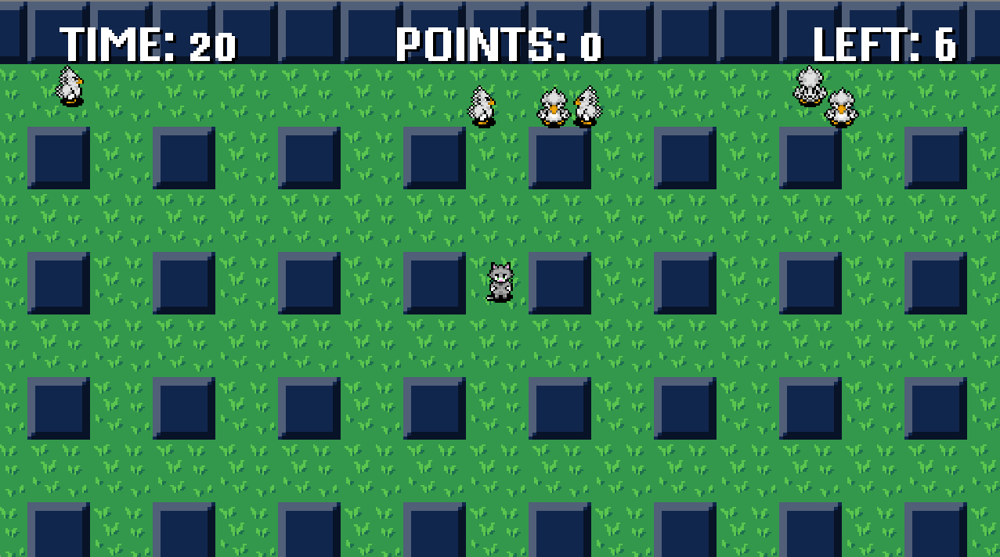
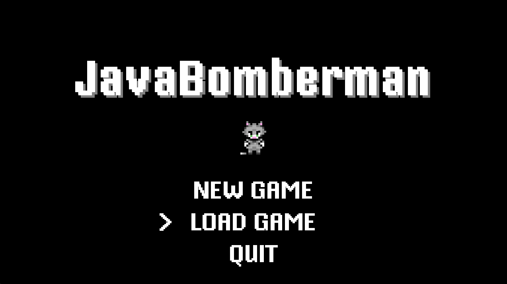
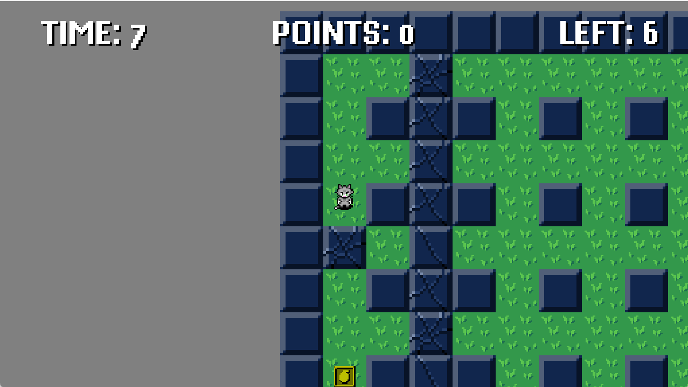
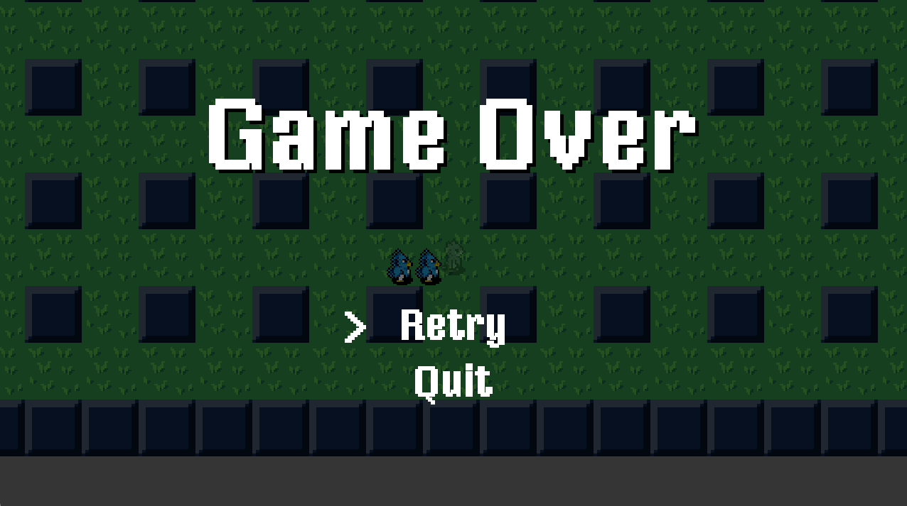

# Bomberman clone



## Description

This project is a clone of the classic NES game Bomberman. The game was created from scratch in pure Java without using third-party libraries. The goal of the project was not only to recreate the mechanics of the original game, but also to understand the work of game engines, as well as apply the principles of OOP, class inheritance and design patterns.
For understand in details follow by link [{#T}](docs/arch.md) 

## Main features

- Recreating classic Bomberman mechanics.
- A simple game engine written from scratch in Java.
- Application of OOP principles and class inheritance.
- Using design patterns to improve code structure.

## Installation

1. Download or clone repository
```bash
    git clone https://github.com/Ahi-Tech86/JavaBomber.git
```
2. Go to the project directory:
```bash
    cd JavaBomber
```
3. Compile the project using Maven:
```bash
    mvn clean install
```

## Launching

To launch the game, run the following command:
```bash
    java -jar target/JavaBomberman-1.0-SNAPSHOT.jar
```

## Control

- Control your character using the W, A, S, D keys
- Plant dynamite with E
- Press P to pause the game
- Avoid explosions and enemies to stay alive and find a way out

## Screenshots





<video width="1280" height="720" controls>
    <source src="repo_files/gameplay/gameplay_video.mp4" type="video/mp4">
</video>

<video width="1280" height="720" controls>
    <source src="repo_files/gameplay/gameplay_video2.mp4" type="video/mp4">
</video>